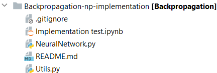
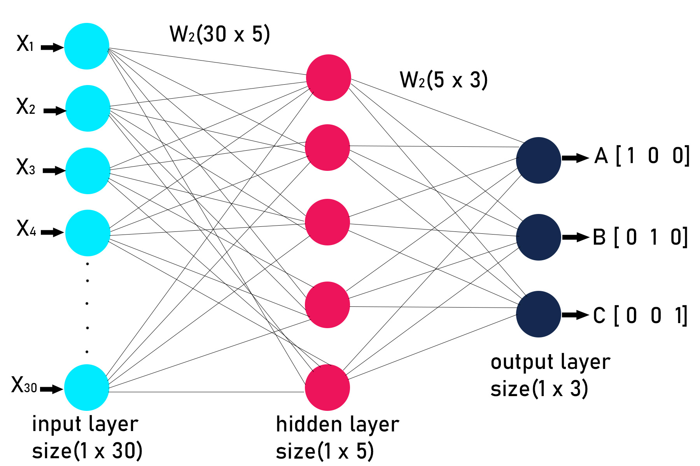
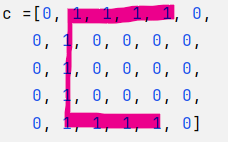

# Implementación del algoritmo Backpropagation de una Red Neuronal simple con Python
## Daniel Quinteiro Donaghy, Carlos Mendoza Eggers

# Introducción

En el campo del aprendizaje automático, la mejora continua de la
precisión y la eficiencia de los modelos de redes neuronales es
esencial. En este trabajo, exploramos una piedra angular en el
desarrollo de estas redes: el algoritmo de ***retropropagación***, o
\"***Backpropagation***\". Nuestra investigación se centra en la
implementación de Backpropagation en un entorno de programación
**Python**, destacando su papel fundamental en la optimización de los
parámetros de la red neuronal.

La capacidad de este algoritmo para calcular eficientemente los
gradientes de la función de pérdida con respecto a los pesos de la red
permite una actualización ponderada y sistemática de los parámetros,
llevando a cabo un proceso iterativo de optimización. La
***retropropagación***, al ajustar los pesos y sesgos de la red de forma
sistemática en función de la pérdida acumulada, se situa como un
elemento esencial en el repertorio de herramientas destinado a mejorar
la eficacia y la capacidad predictiva de las redes neuronales.

A lo largo de este trabajo, exploraremos los fundamentos teóricos del
***Backpropagation*** y su integración en el contexto de las redes
neuronales.Nuestro objetivo es explicar en detalle como funciona este
proceso.Para ello, implementaremos una red neuronal simple, con la que
visualizar y comprender de manera eficiente como funciona este
algoritmo.

# Estructura del proyecto

Nuestra implementación en Python sigue la siguiente estructura:

  

-   En **NeuralNetwork.py** está implementada la Red Neuronal con la que
    probamos el algoritmo. Esta está implementada en una clase llamada
    ***NeuralNetwork*** que contiene los métodos públicos ***train*** y
    ***test***, indispensables a la hora de construir un modelo de este
    estilo; y dos métodos privados: el método ***\_\_feed_forward***
    para el feedforward de la red, y el método
    ***\_\_back_propagation***, mediante el cual obtenemos las derivadas
    del error en función de cada peso.

-   En **Utils.py** están definidas ciertas funciones como la sigmoide,
    la función de pérdida, el método de descenso por gradiente a
    utilizar, etc.

-   Finalmente, las pruebas se realizan en **Implementation
    test.ipynb**, un *Jupyter notebook* en el que comprobamos y
    visualizamos el resultado de la implementación.

El resto de archivos (**.gitignore** y **README.md**) son archivos
comunes en los repositorios de *GitHub* y no tienen nada que ver con el
trabajo.

# La Red Neuronal

Como el objetivo principal de este trabajo era implementar el algoritmo
de Backpropagation de una Red Neuronal, y no una Red Neuronal en sí,
decidimos que la mejor opción era utilizar una red simple desde la que
implementar el algoritmo de Backpropagation.

Para ello, nos inspiramos en una red programada en Numpy que encontramos
en el conocido portal *GeeksForGeeks*[^1]. A partir de ella,
encapsulamos todo el contenido y lo reestructuramos para poder
implementar y poner a prueba el funcionamiento de nuestro algoritmo.\
A continuación, haremos una breve explicación de la arquitectura que
sigue la red que hemos utilizado en este trabajo y cuál es su finalidad.

  

La **entrada de la red** es una **lista binaria** de 30 elementos, que
forman letras si se estructuran en una matriz de 6 filas x 5 columnas.

  

Como podemos comprobar en la figura, en esta lista de 30 elementos, siguiendo el formato
descrito anteriormente, podemos apreciar claramente una letra 'C'.

La red está entrenada con 3 salidas posibles: si la lista de entrada se
asemeja más a una C, a una D, o a una J. Por tanto, la idea principal es
que a partir de una lista binaria de 30 elementos dada, la clasifique
como una de estas tres letras en función de a cuál se parezca más.

Dicho esto, pasaremos a hablar sobre su estructura. Esta red posee 3
capas: una capa de entrada, una capa oculta y una capa de salida.

-   La **capa de entrada** posee 30 neuronas, correspondientes a cada
    uno de los elementos de la entrada de la red. Cada neurona de esta
    capa está conectada a todas las neuronas de la capa oculta.

-   La **capa oculta** tiene 5 neuronas. Cada una de estas neuronas
    recibe las 30 entradas de la capa anterior, las multiplica por su
    vector de pesos único $W_1$ y luego pasa la suma ponderada a través
    de una función
    *sigmoide*[\[eq:sigmoide\]](#eq:sigmoide){reference-type="eqref"
    reference="eq:sigmoide"} para obtener la salida de la neurona.

    $$z_j^{(1)} =w_{1j}^{(1)}x_{1}+ w_{2j}^{(1)}x_{2}+ w_{3j}^{(1)}x_{3} +...+ w_{30j}^{(1)}x_{30}$$

    $$h_j = \sigma(z_j^{(1)}) \quad \text{para } j = 1, 2, 3, 4, 5.$$

-   La **capa de salida** está formada por 3 neuronas. Cada una recibe
    las salidas de las 5 neuronas de la capa oculta, las multiplica por
    otro vector de pesos $W_2$ y pasa la suma a través de una función de
    activación. En nuestro caso es de nuevo una *sigmoide*. La clase con
    el valor más alto se toma como el resultado de la red.

    $$z_i^{(2)} = w_{1i}^{(2)}h_1 + w_{2i}^{(2)}h_2 + w_{3i}^{(2)}h_3 + w_{4i}^{(2)}h_4 + w_{5i}^{(2)}h_5$$

    $$a_i = \sigma(z_i^{(2)}) \quad \text{para } i = 1, 2, 3.$$

La **salida** de la red será:

$$p_i = \underset{i}{\mathrm{argmax}}(a_i)$$

# Backpropagation

La retropropagación es un procedimiento eficiente para actualizar los
pesos en una red neuronal, que aprovecha los cálculos realizados en las
capas posteriores para las anteriores. La *derivada de la función
sigmoide* es un componente clave en este proceso:

$$\sigma(x) = \frac{1}{1+e^{-x}}$$

$$\sigma'(x) = \sigma(x) \cdot (1 - \sigma(x))$$

## Error y Gradientes para la Capa de Salida

El gradiente de la función de pérdida con respecto a los pesos de la
capa de salida se calcula utilizando la regla de la cadena para
descomponer la derivada de la función de pérdida con respecto a los
pesos en términos de derivadas más simples:

$$\frac{\partial L_i}{\partial w_{ij}^{(2)}} = \frac{\partial L_i}{\partial a_i} \cdot \frac{\partial a_i}{\partial z_i^{(2)}} \cdot \frac{\partial z_i^{(2)}}{\partial w_{ij}^{(2)}}$$

Donde:

-   $\frac{\partial L_i}{\partial a_i} = (p_i - y_i)$ es la derivada de
    la función de pérdida con respecto a la activación de la salida.

-   $\frac{\partial a_i}{\partial z_i^{(2)}} = \sigma'(z_i^{(2)})$ es la
    derivada de la activación de la salida con respecto a su entrada
    ponderada, que es simplemente la derivada de la función sigmoide.

-   $\frac{\partial z_i^{(2)}}{\partial w_{ij}^{(2)}} = h_j$ es la
    derivada de la entrada ponderada con respecto al peso, que es la
    activación de la neurona en la capa oculta.

Introducimos el término $\delta_{pi}$ como una representación compacta
del gradiente de la función de pérdida con respecto a la activación de
la salida, que es un componente clave para el cálculo del gradiente de
los pesos:

$$\delta_{pi} = \frac{\partial L_i}{\partial a_i} \cdot \frac{\partial a_i}{\partial z_i^{(2)}} = (p_i - y_i) \cdot \sigma'(z_i^{(2)})$$

Con este término, el gradiente de los pesos de la capa de salida se
simplifica a:

$$\frac{\partial L_i}{\partial w_{ij}^{(2)}} = h_j \cdot \delta_{pi}$$

Esta notación de $\delta$ no solo simplifica la escritura de las
ecuaciones, sino que también refleja la naturaleza modular de la
retropropagación, donde los términos de error calculados para una capa
se pueden reutilizar en la siguiente.

## Reutilización de Términos en la Primera Capa

Para la primera capa, el gradiente de la función de pérdida con respecto
a los pesos se calcula propagando el error hacia atrás desde la capa de
salida. Los términos calculados para la capa de salida se reutilizan
aquí:

$$\frac{\partial L}{\partial w_{jk}^{(1)}} = \sum_{i=1}^{N} \frac{\partial L_i}{\partial w_{jk}^{(1)}}$$

$$\frac{\partial L_i}{\partial w_{jk}^{(1)}} = \frac{\partial L_i}{\partial h_j} \cdot \frac{\partial h_j}{\partial z_j^{(1)}} \cdot \frac{\partial z_j^{(1)}}{\partial w_{jk}^{(1)}}$$

Las siguientes ecuaciones detallan el cálculo de cada uno de los
componentes de la derivada anterior:

$$\frac{\partial L_i}{\partial h_j} = \sum_{k=1}^{M} \delta_{pi} \cdot w_{jk}^{(2)}$$

$$\frac{\partial h_j}{\partial z_j^{(1)}} = \sigma'(z_j^{(1)})$$

$$\frac{\partial z_j^{(1)}}{\partial w_{jk}^{(1)}} = x_k$$

Sustituyendo estos términos, y reutilizando el término de error
$\delta_{pi}$ para la capa oculta, obtenemos el gradiente para los pesos
de la primera capa:

$$\frac{\partial L_i}{\partial w_{jk}^{(1)}} = x_k \cdot \sigma'(z_j^{(1)}) \cdot \sum_{k=1}^{M} \delta_{pi} \cdot w_{jk}^{(2)}$$

Aquí introduciremos otro término $\delta_{hj}$ tal que

$$\delta_{hj} = \sigma'(z_j^{(1)}) \cdot \sum_{k=1}^{M} \delta_{pi} \cdot w_{jk}^{(2)}$$

Que simplifica la ecuación de esta forma:

$$\frac{\partial L_i}{\partial w_{jk}^{(1)}} = x_k \cdot \delta_{hj}$$

Estas ecuaciones muestran cómo los gradientes de la capa oculta están
vinculados con los de la capa de salida, lo que permite que el proceso
de aprendizaje sea eficiente y efectivo.

## Función en Python

Una vez explicados los conceptos teóricos del Backpropagation en nuestra
red neuronal, vamos a ver como lo hemos aplicado en la función de
Python.

    def __back_propagation(self, x, y, alpha):

            input_to_hidden = x.dot(self.w1)
            hidden_activation = sigmoid(input_to_hidden)
            hidden_to_output = hidden_activation.dot(self.w2)
            output_activation = sigmoid(hidden_to_output)

La función toma como entrada *x(datos de entrada)*, *y(etiquetas)* y
*alpha(tasa de aprendizaje)*. Lo primero que calcula es la propagación
hacia adelante *(feedforward)* de la red neuronal. Calcula las salidas
de la capa oculta *(hidden_activation)* y de la capa de salida
*(output_activation)* a partir de las entradas *(x)* y los pesos de cada
capa*(self.w1 y self.w2)*. La función *sigmoid* es la función de
activación sigmoide.

            derivative_output_error = output_activation - y
            derivative_output_activation = sigmoid_prime(hidden_to_output)

En *derivative_output_error* se calcula el error en la capa de salida
restando las salidas predichas *(output_activation)* de las etiquetas
reales *(y)*. Luego en *derivative_output_error* se calcula la derivada
de la función de activación sigmoide en la capa de salida.

            gradient_w2_weights = hidden_activation.T.dot(
            derivative_output_activation * derivative_output_error)

Para hallar los gradientes de $W_2$ se multiplica la transpuesta de las
activaciones en la capa oculta por el producto de la derivada de la
función de activación y el error de la capa de salida. Este calculo
correspondería con la ecuacion $\frac{\partial L_i}{\partial w_{ij}^{(2)}} = \frac{\partial L_i}{\partial a_i} \cdot \frac{\partial a_i}{\partial z_i^{(2)}} \cdot \frac{\partial z_i^{(2)}}{\partial w_{ij}^{(2)}}$

            hidden_error = (derivative_output_error *
            derivative_output_activation).dot(self.w2.T)
            
            derivative_hidden_activation = sigmoid_prime(input_to_hidden)

La variable *hidden_error* almacena la contribución al error en la capa
oculta, considerando cómo los errores en la capa de salida se propagan
hacia atrás a través de los pesos conectando la capa oculta y la capa de
salida. Esto se correspondería con la ecuación $\frac{\partial L_i}{\partial h_j} = \sum_{k=1}^{M} \delta_{pi} \cdot w_{jk}^{(2)}$

En *derivative_hidden_activation* se calcula la derivada de la función
de activación sigmoide en la capa oculta, lo que corresponde con la
ecuación $\frac{\partial h_j}{\partial z_j^{(1)}} = \sigma'(z_j^{(1)})$

        gradient_w1_weights = x.T.dot(derivative_hidden_activation * hidden_error)

Para hallar los gradientes de $W_1$, se multiplica la transposición de
las entradas por el producto de la derivada de la activación oculta y el
error oculto, lo que viene a corresponder la ecuación $\frac{\partial L_i}{\partial w_{jk}^{(1)}} = x_k \cdot \sigma'(z_j^{(1)}) \cdot \sum_{k=1}^{M} \delta_{pi} \cdot w_{jk}^{(2)}$

Para terminar, quedaría actualizar los pesos. Para ello, empleamos un
algoritmo de descenso por el gradiente simple *(gradient_descent)*
utilizando los gradientes calculados y la tasa de aprendizaje *(alpha)*,
que se pasa como parámetro de la función. Además de los propios vectores
de pesos, atributos de la clase *NeuralNetwork.*

        self.w1, self.w2 = gradient_descent(
        self.w1, self.w2, 
        gradient_w1_weights, gradient_w2_weights,
        alpha)

  <b>...</b>

    def gradient_descent(w1,w2,gradient_w1,gradient_w2,alpha):
        w1 -= alpha * gradient_w1
        w2 -= alpha * gradient_w2
        return w1, w2

Basicamente, multiplica los gradientes calculados por la tasa de
aprendizaje y se los resta a los vectores. Finalmente se devuelven $W_1$
y $W_2$ corregidos y se modifican en *self.w1* y *self.w2*.

[^1]: GeeksForGeeks. (2023). *Implementation of Neural Network from Scratch
using NumPy*.
<https://www.geeksforgeeks.org/implementation-of-neural-network-from-scratch-using-numpy/>

